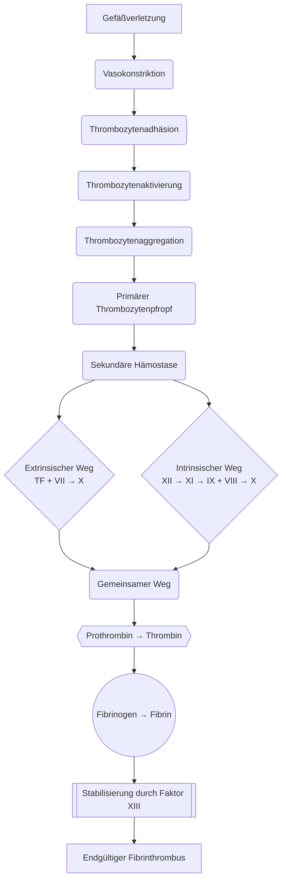

# Haemostase (Bluitstillung)

```mermaid
flowchart TD
    A[Gefäßverletzung] --> B(Vasokonstriktion)
    B --> C(Thrombozytenadhäsion)
    C --> D(Thrombozytenaktivierung)
    D --> E(Thrombozytenaggregation)
    E --> F(Primärer Thrombozytenpfropf)
    F --> G(Sekundäre Hämostase)
    G --> H1{Extrinsischer Weg<br/>TF + VII &rarr; X}
    G --> H2{Intrinsischer Weg<br/>XII &rarr; XI &rarr; IX + VIII &rarr; X}
    H1 --> I(Gemeinsamer Weg)
    H2 --> I
    I --> J{{Prothrombin &rarr; Thrombin}}
    J --> K((Fibrinogen &rarr; Fibrin))
    K --> L[[Stabilisierung durch Faktor XIII]]
    L --> M[Endgültiger Fibrinthrombus]
```
